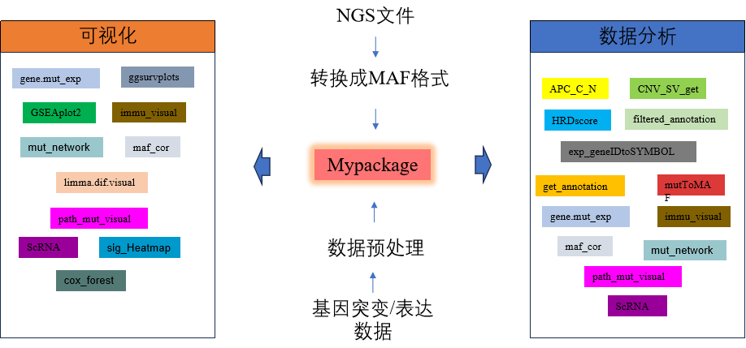
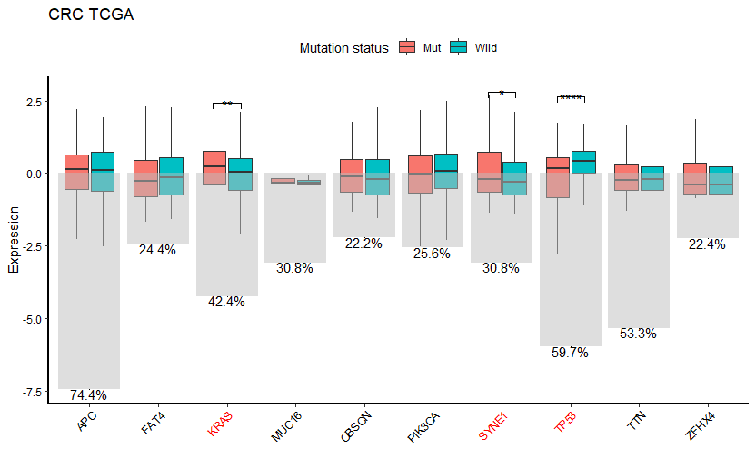

# Introduction

用于NGS测序文件处理，突变相关分析和基因表达分析、可视化操作等

# Generating MAF files

-   对于生信拉的基因突变数据文件，可以用mutToMAF函数转化成MAF文件。或者其它途径得到的MAF格式文件

-   If you're using [ANNOVAR](http://annovar.openbioinformatics.org/en/latest/) for variant annotations, maftools has a handy function `annovarToMaf` for converting tabular annovar outputs to MAF.

# MAF field requirements

MAF files contain many fields ranging from chromosome names to cosmic annotations. However most of the analysis in maftools uses following fields.

-   Mandatory fields: **Hugo_Symbol, Chromosome, Start_Position, End_Position, Reference_Allele, Tumor_Seq_Allele2, Variant_Classification, Variant_Type and Tumor_Sample_Barcode**.

-   Recommended optional fields: non MAF specific fields containing VAF (Variant Allele Frequency) and amino acid change information.

Complete specification of MAF files can be found on [NCI GDC documentation page](https://docs.gdc.cancer.gov/Data/File_Formats/MAF_Format/).

This vignette demonstrates the usage and application of Mypackage on an example MAF file from Yunying cohort [1-5](#references) and TCGA CRC cohort [6](#references).

# Installation

-   目前R包已经上传网络，有需要可以向作者索取安装包或者云安装，安装如下所示.

```{r, eval=FALSE}
install.packages("./Mypackage_1.3.1.tar.gz", repos = NULL, type = "source")
remotes::install_git("https://gitee.com/YPM2022/mypackage")
```

# Overview of the package

Mypackage是集突变分析和基因表达分析于一体的综合性R包，包括MAF格式文件生成，通路突变差异分析，基因表达差异分析和单细胞分析以及相关的可视化.


## Creat MAF files.

'mutToMAF'函数可以将生信拉取的NGS测序文件，例如gzy#6Q_g_639_review_for_report.xls，转换成MAF格式的文件

```{r loadlib, results='hide', message=FALSE}
library(Mypackage)
```

```{r mutToMAF}
#example
data("clindata")#需要整合的样本数据
root_dir <-system.file("example",  package = "Mypackage")#example数据
MAF <-mutToMAF(root_dir=root_dir,clin=clindata,saveDATA=FALSE,mut_filter=TRUE,
                  tumor_t=10,site_depth=100,hotspot_vaf=0.009,
                 non_hotspot_vaf=0.045,hotspotloss_vaf=0.095,non_hotspotloss_vaf=0.195)
head(MAF)
```

### MAF Visualization

#### mut_network

Gene Mutation Co_Occurence/Mutually_Exclusive analysis and visualization

```{r mut_network}
#example
data("mutation_CRC")
mut_network(SNV=mutation_CRC,
                    top=20,pValue=0.01,customdata=NULL)
```

#### maf_cor

This function analyzes mutation and clinical data correlation with MAF format data. It calculates the VAF (Variant Allele Frequency) for each gene and selects the top genes based on the specified criteria. Then, it calculates the correlation between the selected genes and a specified clinical variable. The function also generates a correlation plot to visualize the relationships between the genes and the clinical variable.

```{r maf_cor}
library(corrplot)
#example
data<-maf_cor(mutation_data=MAF,
           clin=NULL,
           gene=NULL,top=20,
           cin_col=NULL,corrplot_method=c("pie"))
head(data)
```

#### path_mut_visual

This function visualizes the mutation rate of tumor pathways based on SNV and gene data.

```{r path_mut_visual}
#example
data("mutation_CRC")
data("gene_group_data")
data("pathway_data")
gene_of_interest<-colnames(gene_group_data)[[2]]
tumor_type="CRC TCGA"
color_vector=c("#757575", "#FF4040")
result <- path_mut_visual(result_data=NULL,
                           SNV = mutation_CRC,
                           gene = gene_of_interest,
                           Gene_group = gene_group_data,
                           Type = c("Wild", "Mut"),
                           pathway_gene_data = pathway_data,
                           tumor = tumor_type,
                           heatmap=TRUE,
                           heatmap_col=NULL,
                           color = color_vector,
                           test = "wilcox.test",ns=FALSE,
                           p_0.05=FALSE,p_0.01=FALSE,p_0.001=FALSE,p_0.0001=FALSE)
print(result$heatmap)
print(result$path_mut_plot)
```

## 基因表达数据.

### Epression data处理

exp_geneIDtoSYMBOL

This function convert the gene name of expression data to SYMBOL.

```{r exp_geneIDtoSYMBOL}
#example
data("exp_raw")
exp_raw<-exp_geneIDtoSYMBOL(exp=exp_raw,genecoltype="ENTREZID")
print(exp_raw[["gene"]][1:10,1:2])
print(exp_raw[["data"]][1:10,1:5])

```

### Epression Visualization

#### immu_visual

This function visualizes the mutation rate of immune score based on provided immune score or gene expression data.

```{r immu_visual}
#example
data("Gene_group_CRC1")
exp_CRC<-exp_raw$data
result<-immu_visual(im=NULL,exp=exp_CRC[,-1],
                    method = 'epic',
                    sample_group=Gene_group_CRC1,
                    tumor="CRC TCGA",heatmap=TRUE,
                    Type=c("Wild", "Mut"),
                    color=c("#757575", "#FF4040"),
                    geom_text=TRUE,
                    test = "wilcox.test")
print(result$imm_plot)

#当method为xCell,estimate和cibersort时,可以用以下方式增强可视化的可读性
result_imm01<-immu_visual(im=NULL,exp=exp_CRC[,-1],#
                          method = 'xCell',
                          sample_group=Gene_group_CRC1,
                          tumor="CRC TCGA",heatmap=TRUE,
                          Type=c("Wild", "Mut"),
                          color=c("#757575", "#FF4040"),
                          geom_text=TRUE,
                          test = "wilcox.test")
result_imm01_1<-immu_visual(im=result_imm01$imm_data[,c(1,67,68,69)],exp=NULL,#
                            method = 'xCell',
                            sample_group=Gene_group_CRC1,
                            tumor=" ",heatmap=TRUE,
                            Type=c("Wild", "Mut"),
                            color=c("#757575", "#FF4040"),
                            geom_text=TRUE,
                            test = "wilcox.test")
result_imm01$imm_plot+ 
  theme(legend.position = "right")+
  annotation_custom(
    grob = ggplotGrob(result_imm01_1$imm_plot+ 
                        theme(legend.position = "none",
                              axis.title.y=element_blank(),
                              axis.text.x = element_text(face = "plain", angle = 30,
                                                         size=8,
                                                         hjust = 1))
    ),
    xmin = 30.5,
    xmax = 53.5,
    ymin = 2.0,
    ymax = 3.5
  ) 
```

#### limma.dif.visual

This function visualizes the Differential Gene Expression Data.

```{r limma.dif.visual}
#example
library(limma)
library(DESeq2)
library(edgeR)
library(tidyverse)
library(ggplot2)
library(ggrepel)
library(ComplexHeatmap)
library(dplyr)
library(org.Hs.eg.db)
library(clusterProfiler)
library(enrichplot)
library(base)
exp_CRC<-exp_raw$data
result<-limma.dif.visual(exprdata=exp_CRC[,-1],
                           pdata=Gene_group_CRC1,datatype="TPM",
                           Type=c("Wild", "Mut"),diff_method="limma",
                           contrastfml="Wild - Mut",
                           tumor="CRC TCGA",
                           P.Value=0.05,
                           logFC=0.5,tidyHeatmap=TRUE,
                           color= NULL,
                           ann_colors = list(regulate = c(Down = "#1B9E77", Up = "#D95F02"),
                           PREX2 = c(Wild = "#757575", Mut = "#FF4040")),
                           Regulate=c("Up","Down"),GO=TRUE,GO.plot="dotplot",split=TRUE,
                           KEGG=TRUE,KEGG.plot="dotplot",rel_heights= c(1.5, 0.5, 1))
print(result$volcano_plot)
print(result$heatmap)
print(result$GO_plot)
print(result$KEGG_plot)
```

#### gene.mut_exp

This function visualizes the Gene Expression Difference with gene mutated status.

```{r gene.mut_exp}
#example
#gene.mut_exp(mutation_data=mutation_CRC,exp=exp_CRC[,-1],colnum=2,gene=NULL,top=10,visual=TRUE,
#                      test_type= "parametric",title= "CRC TCGA",test="wilcox.test",only_red=TRUE,gene_vaf=F,
#                     color_0.05= "#FF34B3",color_0.01="#9400D3",color_0.001="#CD3700",color_0.0001="red",bar=T)
```



#### ScRNA

该函数用于处理单细胞RNA测序数据，包含数据标准化、特征选择和降维分析。

```{r reada}
#example
```

## other

### HRDscore

Determining genomic scar score (telomeric allelic imbalance, loss-off heterozigosity, large-scle transitions), signs of homologous recombination deficiency

```{r HRDscore}
#example
root_dir <-system.file("HRD", package = "Mypackage")
data("metadata")
HRD<-HRDscore(dirpath=root_dir,file_id_map=metadata,ploidy=NULL,reference="grch38")
head(HRD)
```

### sig_Heatmap

heatmap() takes a tbl object and easily produces a ComplexHeatmap plot, with integration with tibble and dplyr frameworks.

```{r sig_Heatmap}
#example
data("input1")
data("condiction")
feas1<-colnames(input1)[3:102]
sig_Heatmap(input = input1, features = feas1,ID ="SAMPLE_ID",show_plot=F,
            condiction=condiction,id_condiction=colnames(condiction)[[1]],col_condiction=colnames(condiction)[[2]],
             cols_group=c("#757575","#FF4040"),row_group=c("red","green"),
             legend_show=TRUE,column_title_size=10,row_title_size=8,
             heatmap_col=NULL,
             #heatmap_col=c("#0505FA", "#FFFFFF", "#FA050D"),
             group = "PREX2",row_title="Regulate", scale = TRUE,name="Expression")
```

### ggsurvplots

Drawing Survival Curves Using ggplot2

```{r ggsurvplots}
#example
data("clin_TCGA")
ggsurvplots(data = clin_TCGA, conf.int = FALSE,time_col = "PFS_MONTHS",
                 status_col = "PFS_STATUS", group_col = "Status", pvalue_table = TRUE,
                 palette = ggsci::pal_ucscgb()(4), risk.table = FALSE, title = NULL,
                 legend.labs = c("no KRAS or TP53", "TP53", "KRAS", "KRAS&TP53"),
                 xlab = "PFS_MONTHS", ylab = "Survival probability",
                 surv.median.line="hv",surv.scale="default",legend=FALSE)
```

### cox_forest

Cox Proportional Hazards Univariate and Multivariate Forest Plot Generator

```{r cox_forest}
#example
data("aa")
cox   =    cox_forest(data=aa,
                          time_col = "PFI.time",
                          status_col = "PFI",
                          Univariate=T,
                          univar_predictors=colnames(aa)[c(5:7,18:22,34,31)],
                          Multivariate=T,
                          multivar_predictors = colnames(aa)[c(5:7,18:21,33,31)],
                          show_plots = T,xticks1=NULL,#c(0,0.25,0.5,0.75,1.00,1.25,1.5,6.5,11),
                          xticks2=NULL,#c(0,0.25,0.5,0.75,1.00,2,2.5,6,15),
                          title_univar = "PFI Univariate",
                          title_multivar = "PFI Multivariate",
                          use_baseline_table = TRUE,all=F,forestplot=F,
                          ci_pch=16,ci_col="darkred",ci_line="lightgreen",zero_col="#e22e2a",
                         log2=T,footnote=paste("\nHRD5: with HRD value adjusted(median)", "HRD adjusted =   LST-15.5*ploidy+LOH+TAI ",sep = "\n"))
print(cox[["univariate"]][["uniforest"]])
#grid::grid.newpage()
print(cox[["multivariate"]][["multiforest"]])
```


### GSEAplot2

GSEA plot that mimic the plot generated by broad institute's GSEA software

```{r GSEAplot2}
#example
GSEAplot2(result$GO,geneSetID=if(length(result$GO@result[["ID"]])>10) c(1:10) else  c(1:c(1:length(result$GO@result[["ID"]]))),ES_geom = "line",legend.position ="none",pvalue_table=FALSE,
                            title = paste("GO enrichment"),rel_heights = c(4, 3, 2),
                            base_size = 20,Type=c("Wild", "Mut"))

```

# References {#references}

1.  Yao J, Sun Q, Wu H, et al. Decoding the molecular landscape: HER2 and PD-L1 in advanced gastric cancer. Front Immunol. 2025;16:1567308. <doi:10.3389/fimmu.2025.1567308>
2.  Qiu Q, Tan D, Chen Q, et al. Clinical implications of PD-L1 expression and pathway-related molecular subtypes in advanced Asian colorectal cancer patients. Am J Cancer Res. 2024;14(2):796-808. <doi:10.62347/FSSF9938>
3.  Ding W, Yang P, Zhao X, et al. Unraveling EGFR-TKI resistance in lung cancer with high PD-L1 or TMB in EGFR-sensitive mutations. Respir Res. 2024;25(1):40. <doi:10.1186/s12931-023-02656-3>
4.  Peng H, Ying J, Zang J, et al. Specific Mutations in APC, with Prognostic Implications in Metastatic Colorectal Cancer. Cancer Res Treat. 2023;55(4):1270-1280. <doi:10.4143/crt.2023.415>
5.  Jiang Y, Mai G, Zhao X, et al. Molecular characterization and prognostic implications of KRAS mutations in pancreatic cancer patients: insights from multi-cohort analysis. NPJ Precis Oncol. 2025;9(1):299. Published 2025 Aug 22. <doi:10.1038/s41698-025-01087-1>
5.  Cancer Genome Atlas Network. Comprehensive molecular characterization of human colon and rectal cancer. Nature. 2012;487(7407):330-337. Published 2012 Jul 18. <doi:10.1038/nature11252>
